# 树

- 二叉树、二叉搜索树（BST）完全二叉树、满二叉树
- 平衡树：AVL、红黑树（底层常用）
- 字典树（Trie）：字符串前缀匹配
- B + 树：数据库索引核心

## 二叉树

### 什么是二叉树

二叉树是这么一种树状结构：每个节点最多有两个孩子，左孩子和右孩子

重要的二叉树结构

- **普通二叉树**只满足：每个节点最多两个孩子，无其他规则
- **完全二叉树**（complete binary tree）是一种二叉树结构，除最后一层以外，每一层都必须填满，填充时要遵从先左后右
- **平衡二叉树**（balance binary tree）是一种二叉树结构，其中每个节点的左右子树高度相差不超过 1
- **满二叉树（Perfect Binary Tree，国内标准定义）** 是一种每层节点都填满、结构完美对称的特殊二叉树。
- **二叉搜索树（Binary Search Tree，BST）** 是最常用的二叉树，核心特点是**左小右大**，方便快速查找。

### 存储

二叉树的存储一共就**两种**：**顺序存储（数组）** 和 **链式存储（链表）**

用**一维数组**存二叉树节点，按**层序遍历**顺序放。

- **完全二叉树、满二叉树**
- 不适合普通歪斜树（浪费空间）

每个节点包含三部分：

- 数据域
- 左孩子指针
- 右孩子指针

### 遍历

1. 广度优先遍历（Breadth-first order）：尽可能先访问距离根最近的节点，也称为层序遍历
2. 深度优先遍历（Depth-first order）：对于二叉树，可以进一步分成三种（要深入到叶子节点）
   1. pre-order 前序遍历，对于每一棵子树，先访问该节点，然后是左子树，最后是右子树
   2. in-order 中序遍历，对于每一棵子树，先访问左子树，然后是该节点，最后是右子树
   3. post-order 后序遍历，对于每一棵子树，先访问左子树，然后是右子树，最后是该节点


1. 初始化，将根节点加入队列
2. 循环处理队列中每个节点，直至队列为空
3. 每次循环内处理节点后，将它的孩子节点（即下一层的节点）加入队列

> 注意
>
> * 以上用队列来层序遍历是针对  TreeNode 这种方式表示的二叉树
> * 对于数组表现的二叉树，则直接遍历数组即可，自然为层序遍历的顺序


### 代码

- **查找**
- **插入**
- **删除**
- **求深度 / 高度**
- **求节点总数 / 叶子节点数**
- **判断是否平衡 / 完全二叉树 / 满二叉树**
- **翻转二叉树**
- **序列化与反序列化**（转字符串再还原）

**递归实现**

```
package com.itheima.datastructure.binarysearchtree;

import java.util.LinkedList;
import java.util.Queue;

// 二叉树节点类
class TreeNode {
    int val;
    TreeNode left;
    TreeNode right;

    TreeNode(int val) {
        this.val = val;
        this.left = null;
        this.right = null;
    }
}

public class BinaryTree {

// ------------------- 1. 前序遍历：根 -> 左 -> 右 -------------------
    public void preOrder(TreeNode root) {
        if (root == null) return;
        System.out.print(root.val + " ");
        preOrder(root.left);
        preOrder(root.right);
    }

    // ------------------- 2. 中序遍历：左 -> 根 -> 右 -------------------
    public void inOrder(TreeNode root) {
        if (root == null) return;
        inOrder(root.left);
        System.out.print(root.val + " ");
        inOrder(root.right);
    }

    // ------------------- 3. 后序遍历：左 -> 右 -> 根 -------------------
    public void postOrder(TreeNode root) {
        if (root == null) return;
        postOrder(root.left);
        postOrder(root.right);
        System.out.print(root.val + " ");
    }

    // ------------------- 4. 层序遍历（递归版） -------------------
    public void levelOrder(TreeNode root) {
        if (root == null) return;
        int depth = maxDepth(root);
        for (int i = 1; i <= depth; i++) {
            printLevel(root, i);
        }
    }

    // 打印第 level 层
    private void printLevel(TreeNode root, int level) {
        if (root == null) return;
        if (level == 1) {
            System.out.print(root.val + " ");
        } else {
            printLevel(root.left, level - 1);
            printLevel(root.right, level - 1);
        }
    }

    // ------------------- 5. 求树的最大深度 -------------------
    public int maxDepth(TreeNode root) {
        if (root == null) return 0;
        int leftDepth = maxDepth(root.left);
        int rightDepth = maxDepth(root.right);
        return Math.max(leftDepth, rightDepth) + 1;
    }

    // ------------------- 6. 总结点个数 -------------------
    public int countNodes(TreeNode root) {
        if (root == null) return 0;
        return countNodes(root.left) + countNodes(root.right) + 1;
    }

    // ------------------- 7. 叶子节点个数 -------------------
    public int countLeafNodes(TreeNode root) {
        if (root == null) return 0;
        if (root.left == null && root.right == null) return 1;
        return countLeafNodes(root.left) + countLeafNodes(root.right);
    }

    // ------------------- 8. 查找值为 target 的节点 -------------------
    public TreeNode searchNode(TreeNode root, int target) {
        if (root == null) return null;
        if (root.val == target) return root;
        TreeNode leftFind = searchNode(root.left, target);
        if (leftFind != null) return leftFind;
        return searchNode(root.right, target);
    }
// ==================== 以下是新增功能 ====================

    // ------------------- 9. 插入节点（BST规则） -------------------
    public TreeNode insert(TreeNode root, int val) {
        if (root == null) return new TreeNode(val);
        if (val < root.val) root.left = insert(root.left, val);
        else if (val > root.val) root.right = insert(root.right, val);
        return root;
    }

    // ------------------- 10. 删除节点（BST规则） -------------------
    public TreeNode delete(TreeNode root, int val) {
        if (root == null) return null;

        if (val < root.val) root.left = delete(root.left, val);
        else if (val > root.val) root.right = delete(root.right, val);
        else {
            if (root.left == null) return root.right;
            if (root.right == null) return root.left;

            TreeNode min = root.right;
            while (min.left != null) min = min.left;
            root.val = min.val;
            root.right = delete(root.right, min.val);
        }
        return root;
    }

    // ------------------- 11. 翻转二叉树 -------------------
    public TreeNode invertTree(TreeNode root) {
        if (root == null) return null;
        TreeNode left = invertTree(root.left);
        TreeNode right = invertTree(root.right);
        root.left = right;
        root.right = left;
        return root;
    }

    // ------------------- 12. 序列化（树 → 字符串） -------------------
    public String serialize(TreeNode root) {
        if (root == null) return "null,";
        String res = root.val + ",";
        res += serialize(root.left);
        res += serialize(root.right);
        return res;
    }

    // ------------------- 13. 反序列化（字符串 → 树） -------------------
    public TreeNode deserialize(String data) {
        String[] arr = data.split(",");
        Queue<String> q = new LinkedList<>();
        for (String s : arr) q.offer(s);
        return buildTree(q);
    }

    private TreeNode buildTree(Queue<String> q) {
        String val = q.poll();
        if (val.equals("null")) return null;
        TreeNode root = new TreeNode(Integer.parseInt(val));
        root.left = buildTree(q);
        root.right = buildTree(q);
        return root;
    }

    // ------------------- 14. 判断是否平衡二叉树 -------------------
    public boolean isBalanced(TreeNode root) {
        if (root == null) return true;
        int l = maxDepth(root.left);
        int r = maxDepth(root.right);
        if (Math.abs(l - r) > 1) return false;
        return isBalanced(root.left) && isBalanced(root.right);
    }

    // ------------------- 15. 判断是否完全二叉树 -------------------
    public boolean isComplete(TreeNode root) {
        if (root == null) return true;
        Queue<TreeNode> q = new LinkedList<>();
        q.offer(root);
        boolean end = false;

        while (!q.isEmpty()) {
            TreeNode cur = q.poll();
            if (cur == null) end = true;
            else {
                if (end) return false;
                q.offer(cur.left);
                q.offer(cur.right);
            }
        }
        return true;
    }

    // ------------------- 16. 判断是否满二叉树 -------------------
    public boolean isFull(TreeNode root) {
        if (root == null) return true;
        if (root.left == null && root.right == null) return true;
        if (root.left == null || root.right == null) return false;
        return isFull(root.left) && isFull(root.right);
    }


      public static void main(String[] args) {
        // 构建一棵二叉树
        //        1
        //       / \
        //      2   3
        //     / \
        //    4   5
        TreeNode root = new TreeNode(1);
        root.left = new TreeNode(2);
        root.right = new TreeNode(3);
        root.left.left = new TreeNode(4);
        root.left.right = new TreeNode(5);

        BinaryTree bt = new BinaryTree();

        System.out.print("前序遍历：");
        bt.preOrder(root);
        System.out.println();

        System.out.print("中序遍历：");
        bt.inOrder(root);
        System.out.println();

        System.out.print("后序遍历：");
        bt.postOrder(root);
        System.out.println();

        System.out.print("层序遍历：");
        bt.levelOrder(root);
        System.out.println();

        System.out.println("树的深度：" + bt.maxDepth(root));
        System.out.println("总结点个数：" + bt.countNodes(root));
        System.out.println("叶子节点个数：" + bt.countLeafNodes(root));

        int target = 5;
        TreeNode res = bt.searchNode(root, target);
        if (res != null) {
            System.out.println("找到节点：" + res.val);
        } else {
            System.out.println("未找到节点：" + target);
        }
    
      // ==================== 新增功能测试 ====================
        System.out.println("\n===== 增强功能测试 =====");

        // 插入
        root = bt.insert(root, 6);
        System.out.print("插入6后层序：");
        bt.levelOrder(root);
        System.out.println();

        // 删除
        root = bt.delete(root, 3);
        System.out.print("删除3后层序：");
        bt.levelOrder(root);
        System.out.println();

        // 翻转
        root = bt.invertTree(root);
        System.out.print("翻转后层序：");
        bt.levelOrder(root);
        root = bt.invertTree(root); // 翻回来
        System.out.println();

        // 序列化
        String ser = bt.serialize(root);
        System.out.println("序列化结果：" + ser);

        // 反序列化
        TreeNode newRoot = bt.deserialize(ser);
        System.out.print("反序列化后层序：");
        bt.levelOrder(newRoot);
        System.out.println();

        // 判断
        System.out.println("是否平衡：" + bt.isBalanced(root));
        System.out.println("是否完全二叉树：" + bt.isComplete(root));
        System.out.println("是否满二叉树：" + bt.isFull(root));
    


    }
}

```

**迭代实现**

```
package com.itheima.datastructure.binarysearchtree;
import java.util.*;

// 二叉树节点
class TreeNode {
    int val;
    TreeNode left;
    TreeNode right;

    TreeNode(int val) {
        this.val = val;
        this.left = null;
        this.right = null;
    }
}
public class BinaryTreeIterative {
    // ==================== 1. 前序遍历（迭代） ====================
    public void preOrder(TreeNode root) {
        if (root == null) return;
        Deque<TreeNode> stack = new ArrayDeque<>();
        stack.push(root);
        while (!stack.isEmpty()) {
            TreeNode node = stack.pop();
            System.out.print(node.val + " ");
            if (node.right != null) stack.push(node.right);
            if (node.left != null) stack.push(node.left);
        }
    }

    // ==================== 2. 中序遍历（迭代） ====================
    public void inOrder(TreeNode root) {
        if (root == null) return;
        Deque<TreeNode> stack = new ArrayDeque<>();
        TreeNode cur = root;
        while (cur != null || !stack.isEmpty()) {
            while (cur != null) {
                stack.push(cur);
                cur = cur.left;
            }
            cur = stack.pop();
            System.out.print(cur.val + " ");
            cur = cur.right;
        }
    }

    // ==================== 3. 后序遍历（迭代） ====================
    public void postOrder(TreeNode root) {
        if (root == null) return;
        Deque<TreeNode> stack = new ArrayDeque<>();
        Stack<Integer> res = new Stack<>();
        stack.push(root);
        while (!stack.isEmpty()) {
            TreeNode node = stack.pop();
            res.push(node.val);
            if (node.left != null) stack.push(node.left);
            if (node.right != null) stack.push(node.right);
        }
        while (!res.isEmpty()) {
            System.out.print(res.pop() + " ");
        }
    }

    // ==================== 4. 层序遍历（迭代） ====================
    public void levelOrder(TreeNode root) {
        if (root == null) return;
        Queue<TreeNode> q = new LinkedList<>();
        q.offer(root);
        while (!q.isEmpty()) {
            TreeNode node = q.poll();
            System.out.print(node.val + " ");
            if (node.left != null) q.offer(node.left);
            if (node.right != null) q.offer(node.right);
        }
    }

    // ==================== 5. 最大深度（迭代） ====================
    public int maxDepth(TreeNode root) {
        if (root == null) return 0;
        Queue<TreeNode> q = new LinkedList<>();
        q.offer(root);
        int depth = 0;
        while (!q.isEmpty()) {
            int size = q.size();
            depth++;
            for (int i = 0; i < size; i++) {
                TreeNode node = q.poll();
                if (node.left != null) q.offer(node.left);
                if (node.right != null) q.offer(node.right);
            }
        }
        return depth;
    }

    // ==================== 6. 总结点个数（迭代） ====================
    public int countNodes(TreeNode root) {
        if (root == null) return 0;
        Queue<TreeNode> q = new LinkedList<>();
        q.offer(root);
        int count = 0;
        while (!q.isEmpty()) {
            TreeNode node = q.poll();
            count++;
            if (node.left != null) q.offer(node.left);
            if (node.right != null) q.offer(node.right);
        }
        return count;
    }

    // ==================== 7. 叶子节点个数（迭代） ====================
    public int countLeafNodes(TreeNode root) {
        if (root == null) return 0;
        Queue<TreeNode> q = new LinkedList<>();
        q.offer(root);
        int count = 0;
        while (!q.isEmpty()) {
            TreeNode node = q.poll();
            if (node.left == null && node.right == null) count++;
            if (node.left != null) q.offer(node.left);
            if (node.right != null) q.offer(node.right);
        }
        return count;
    }

    // ==================== 8. 查找节点（迭代） ====================
    public TreeNode searchNode(TreeNode root, int target) {
        if (root == null) return null;
        Queue<TreeNode> q = new LinkedList<>();
        q.offer(root);
        while (!q.isEmpty()) {
            TreeNode node = q.poll();
            if (node.val == target) return node;
            if (node.left != null) q.offer(node.left);
            if (node.right != null) q.offer(node.right);
        }
        return null;
    }

    // ==================== 9. BST 插入（迭代） ====================
    public TreeNode insertBST(TreeNode root, int val) {
        if (root == null) return new TreeNode(val);
        TreeNode cur = root;
        TreeNode parent = null;
        while (cur != null) {
            parent = cur;
            if (val < cur.val) cur = cur.left;
            else if (val > cur.val) cur = cur.right;
            else return root; // 已存在
        }
        if (val < parent.val) parent.left = new TreeNode(val);
        else parent.right = new TreeNode(val);
        return root;
    }

    // ==================== 10. BST 删除（迭代） ====================
    public TreeNode deleteBST(TreeNode root, int key) {
        TreeNode cur = root;
        TreeNode parent = null;

        // 找节点
        while (cur != null && cur.val != key) {
            parent = cur;
            cur = key < cur.val ? cur.left : cur.right;
        }
        if (cur == null) return root; // 没找到

        // 情况1：叶子 or 单孩子
        if (cur.left == null || cur.right == null) {
            TreeNode child = cur.left != null ? cur.left : cur.right;
            if (parent == null) return child;
            if (parent.left == cur) parent.left = child;
            else parent.right = child;
        } else {
            // 情况2：两个孩子，找后继（右子树最小）
            TreeNode minParent = cur;
            TreeNode minNode = cur.right;
            while (minNode.left != null) {
                minParent = minNode;
                minNode = minNode.left;
            }
            cur.val = minNode.val;
            if (minParent.left == minNode) minParent.left = minNode.right;
            else minParent.right = minNode.right;
        }
        return root;
    }

    // ==================== 11. 翻转二叉树（迭代） ====================
    public TreeNode invertTree(TreeNode root) {
        if (root == null) return null;
        Queue<TreeNode> q = new LinkedList<>();
        q.offer(root);
        while (!q.isEmpty()) {
            TreeNode node = q.poll();
            // 交换左右
            TreeNode temp = node.left;
            node.left = node.right;
            node.right = temp;
            if (node.left != null) q.offer(node.left);
            if (node.right != null) q.offer(node.right);
        }
        return root;
    }

    // ==================== 12. 序列化（层序迭代） ====================
    public String serialize(TreeNode root) {
        if (root == null) return "null";
        StringBuilder sb = new StringBuilder();
        Queue<TreeNode> q = new LinkedList<>();
        q.offer(root);
        while (!q.isEmpty()) {
            TreeNode node = q.poll();
            if (node == null) {
                sb.append("null,");
                continue;
            }
            sb.append(node.val).append(",");
            q.offer(node.left);
            q.offer(node.right);
        }
        return sb.toString();
    }

    // ==================== 13. 反序列化（迭代） ====================
    public TreeNode deserialize(String data) {
        if (data.equals("null")) return null;
        String[] nodes = data.split(",");
        Queue<TreeNode> q = new LinkedList<>();
        TreeNode root = new TreeNode(Integer.parseInt(nodes[0]));
        q.offer(root);
        int i = 1;
        while (!q.isEmpty() && i < nodes.length) {
            TreeNode parent = q.poll();
            // 左
            if (!nodes[i].equals("null")) {
                parent.left = new TreeNode(Integer.parseInt(nodes[i]));
                q.offer(parent.left);
            }
            i++;
            // 右
            if (i < nodes.length && !nodes[i].equals("null")) {
                parent.right = new TreeNode(Integer.parseInt(nodes[i]));
                q.offer(parent.right);
            }
            i++;
        }
        return root;
    }

    // ==================== 14. 判断平衡二叉树（迭代） ====================
    public boolean isBalanced(TreeNode root) {
        if (root == null) return true;
        Queue<TreeNode> q = new LinkedList<>();
        q.offer(root);
        while (!q.isEmpty()) {
            TreeNode node = q.poll();
            int l = maxDepth(node.left);
            int r = maxDepth(node.right);
            if (Math.abs(l - r) > 1) return false;
            if (node.left != null) q.offer(node.left);
            if (node.right != null) q.offer(node.right);
        }
        return true;
    }

    // ==================== 15. 判断完全二叉树（迭代） ====================
    public boolean isComplete(TreeNode root) {
        if (root == null) return true;
        Queue<TreeNode> q = new LinkedList<>();
        q.offer(root);
        boolean flag = false;
        while (!q.isEmpty()) {
            TreeNode node = q.poll();
            if (node == null) flag = true;
            else {
                if (flag) return false;
                q.offer(node.left);
                q.offer(node.right);
            }
        }
        return true;
    }

    // ==================== 16. 判断满二叉树（迭代） ====================
    public boolean isFull(TreeNode root) {
        if (root == null) return true;
        Queue<TreeNode> q = new LinkedList<>();
        q.offer(root);
        while (!q.isEmpty()) {
            TreeNode node = q.poll();
            // 要么两个孩子，要么叶子
            if ((node.left == null && node.right != null) ||
                (node.left != null && node.right == null))
                return false;
            if (node.left != null) q.offer(node.left);
            if (node.right != null) q.offer(node.right);
        }
        return true;
    }


    public static void main(String[] args) {
        // 构建树
        //        1
        //       / \
        //      2   3
        //     / \
        //    4   5
        TreeNode root = new TreeNode(1);
        root.left = new TreeNode(2);
        root.right = new TreeNode(3);
        root.left.left = new TreeNode(4);
        root.left.right = new TreeNode(5);

        BinaryTreeIterative bt = new BinaryTreeIterative();

        System.out.print("前序："); bt.preOrder(root); System.out.println();
        System.out.print("中序："); bt.inOrder(root); System.out.println();
        System.out.print("后序："); bt.postOrder(root); System.out.println();
        System.out.print("层序："); bt.levelOrder(root); System.out.println();

        System.out.println("深度：" + bt.maxDepth(root));
        System.out.println("总节点：" + bt.countNodes(root));
        System.out.println("叶子数：" + bt.countLeafNodes(root));

        int target = 5;
        TreeNode find = bt.searchNode(root, target);
        System.out.println("查找" + target + "：" + (find != null ? "找到" : "未找到"));

        // 插入
        root = bt.insertBST(root, 6);
        System.out.print("\n插入6层序："); bt.levelOrder(root); System.out.println();

        // 删除
        root = bt.deleteBST(root, 3);
        System.out.print("删除3层序："); bt.levelOrder(root); System.out.println();

        // 翻转
        root = bt.invertTree(root);
        System.out.print("翻转层序："); bt.levelOrder(root);
        root = bt.invertTree(root); // 复原
        System.out.println();

        // 序列化 & 反序列化
        String ser = bt.serialize(root);
        System.out.println("序列化：" + ser);
        TreeNode deRoot = bt.deserialize(ser);
        System.out.print("反序列化层序："); bt.levelOrder(deRoot); System.out.println();

        // 判断
        System.out.println("\n是否平衡：" + bt.isBalanced(root));
        System.out.println("是否完全：" + bt.isComplete(root));
        System.out.println("是否满二叉树：" + bt.isFull(root));
    }
}

```

### 区别

| 对比维度       | 递归（Recursion）              | 迭代（Iteration）            |
| -------------- | ------------------------------ | ---------------------------- |
| **实现方式**   | 方法自身调用自身               | 循环 + 栈 / 队列 手动模拟    |
| **代码风格**   | 简洁、优雅、逻辑清晰           | 代码稍长，细节较多           |
| **空间开销**   | 系统调用栈，深度大易**栈溢出** | 手动控制栈 / 队列，不易溢出  |
| **执行效率**   | 有方法调用开销，稍慢           | 无额外调用开销，**更快**     |
| **可读性**     | 极高，符合树的天然结构         | 较低，需要理解栈 / 队列逻辑  |
| **控制难度**   | 简单，不用管遍历细节           | 稍复杂，需手动控制节点进出   |
| **适用场景**   | 算法演示、面试手写、数据量小   | 工程实际、大数据量、避免溢出 |
| **二叉树遍历** | 几行代码完成前中后序           | 需借助栈实现，代码量更大     |
| **内存风险**   | 树很深时 StackOverflowError    | 稳定，无系统栈溢出问题       |
| **调试难度**   | 较难，调用栈层级深             | 较容易，单循环可断点调试     |

## 红黑树

### 红黑树/AVL

 redblacktree

不会 “歪” 成一条链表的二叉搜索树，就叫平衡树。Balanced Tree

保证增删查改的时间复杂度始终是 O (log n)，不退化。

一棵二叉树是**平衡**的，意思是：对于树上**任意节点**，它的**左子树高度**和**右子树高度**的差值不能太大。

只要满足这个，树就不会太偏、太深，效率就稳定。

| 对比项   | AVL 树                        | 红黑树                           |
| -------- | ----------------------------- | -------------------------------- |
| 平衡标准 | **严格平衡**左右子树高度差 ≤1 | **弱平衡**最长路径 ≤ 2× 最短路径 |
| 旋转次数 | 多，插入删除都可能频繁旋转    | 少，最多旋转 2 次就平衡          |
| 查找效率 | 更矮更平衡，**查询更快**      | 略高一点，查询稍慢于 AVL         |
| 插入删除 | 效率较低，平衡开销大          | **效率更高**，适合频繁改动       |
| 结构记录 | 每个节点存**高度**            | 每个节点存**颜色**（红 / 黑）    |
| 适用场景 | **查询多、改动少**的场景      | **增删频繁**的场景               |
| 实际使用 | 教材、理论多                  | 工程实际极常用                   |

### 定义

它就是一棵**自平衡的二叉查找树**，用来解决普通二叉树容易变成 “一条链表” 的问题，保证查询效率稳定在 **O(log n)**

**TreeMap、TreeSet** 底层就是红黑树

**HashMap JDK1.8** 链表过长时也会转成红黑树

就是二叉树，但每个节点多了一个**颜色**：

- 红色
- 黑色

并遵守几条固定规则，保证树不会歪、不会太深。

**核心规则**

1. 每个节点只能是 **红色 或 黑色**

2. **根节点一定是黑色**

3. 所有**叶子节点（空节点）都是黑色**

4. 如果一个节点是红色，那它的两个子节点一定都是黑色

   （不能出现两个红色节点连在一起）

5. 从任意节点到它所有叶子节点的路径上，**黑色节点数量相同**

只要满足这些，这棵树就**不会严重失衡**，高度永远控制在 log n 级别。

红黑树：通过**变色 + 左旋 + 右旋**自动平衡，始终 O (log n)


### 方法

**1. 左旋（Left Rotate）**

- 以某个节点为轴，**向右旋转**，右孩子变父节点
- 调整父子关系，维持二叉搜索树性质

**2. 右旋（Right Rotate）**

- 以某个节点为轴，**向左旋转**，左孩子变父节点

**3. 插入（Insert）**

1. 按二叉搜索树规则插入节点，**新节点默认为红色**
2. 检查是否违反红黑树规则
3. 通过 **变色 + 旋转** 修复平衡

**4. 删除（Delete）**

1. 按 BST 规则找到节点并删除
2. 判断删除节点颜色，判断是否产生 “双黑”
3. 通过 **变色 + 旋转** 修复平衡

**5. 查找（Search）**

- 和普通二叉搜索树一样：左小右大遍历查找
- 时间复杂度 O (log n)

**6. 最大值 / 最小值查找**

- 最小值：一直向左走到叶子
- 最大值：一直向右走到叶子

**7. 前驱节点 / 后继节点查找**

- 前驱：左子树最大节点
- 后继：右子树最小节点

**8. 遍历（同二叉树）**

- 前序、中序、后序、层序遍历
- 中序遍历依然是**有序序列**

### 代码实现

```
package com.itheima.datastructure.redblacktree;

import java.util.LinkedList;
import java.util.Queue;

public class RedBlackTree1 {
    // 定义颜色常量 红色 黑色
    private static final boolean RED = false;
    private static final boolean BLACK = true;

    class Node {
        int key;//储存值
        boolean color;//颜色
        Node left, right, parent;//存储节点 左右

        Node(int key) {
            this.key = key;
            this.color = RED; // 新节点默认红色
        }
    }
// 这一行代码定义了一个私有的 Node 类型的成员变量 root，用于存储红黑树的根节点
    private Node root;

    public RedBlackTree1() {
        root = null;
    }

    // ------------------------------
    // 旋转：左旋
    // ------------------------------
    private void leftRotate(Node x) {
        System.out.println("[日志] 执行左旋，节点: " + x.key);
        Node y = x.right;
        x.right = y.left;

        if (y.left != null)
            y.left.parent = x;

        y.parent = x.parent;

        if (x.parent == null)
            root = y;
        else if (x == x.parent.left)
            x.parent.left = y;
        else
            x.parent.right = y;

        y.left = x;
        x.parent = y;
    }

    // ------------------------------
    // 旋转：右旋
    // ------------------------------
    private void rightRotate(Node y) {
        System.out.println("[日志] 执行右旋，节点: " + y.key);
        Node x = y.left;
        y.left = x.right;

        if (x.right != null)
            x.right.parent = y;

        x.parent = y.parent;

        if (y.parent == null)
            root = x;
        else if (y == y.parent.right)
            y.parent.right = x;
        else
            y.parent.left = x;

        x.right = y;
        y.parent = x;
    }

    // ------------------------------
    // 插入
    // ------------------------------
    public void insert(int key) {
        System.out.println("\n===== 插入节点：" + key + " =====");
        Node z = new Node(key);
        Node y = null;
        Node x = root;

        while (x != null) {
            y = x;
            if (z.key < x.key)
                x = x.left;
            else
                x = x.right;
        }

        z.parent = y;
        if (y == null)
            root = z;
        else if (z.key < y.key)
            y.left = z;
        else
            y.right = z;

        fixInsert(z);
        System.out.println("插入完成，当前树结构：");
        printTree();
    }

    // 插入修复
    private void fixInsert(Node z) {
        while (z.parent != null && z.parent.color == RED) {
            if (z.parent == z.parent.parent.left) {
                Node uncle = z.parent.parent.right;

                // 情况1：叔叔红色
                if (uncle != null && uncle.color == RED) {
                    System.out.println("[日志] 情况1：叔叔红色，变色");
                    z.parent.color = BLACK;
                    uncle.color = BLACK;
                    z.parent.parent.color = RED;
                    z = z.parent.parent;
                } else {
                    // 情况2
                    if (z == z.parent.right) {
                        System.out.println("[日志] 情况2：转成情况3");
                        z = z.parent;
                        leftRotate(z);
                    }
                    // 情况3
                    System.out.println("[日志] 情况3：右旋+变色");
                    z.parent.color = BLACK;
                    z.parent.parent.color = RED;
                    rightRotate(z.parent.parent);
                }
            } else {
                // 对称
                Node uncle = z.parent.parent.left;
                if (uncle != null && uncle.color == RED) {
                    System.out.println("[日志] 情况1（对称）：叔叔红色，变色");
                    z.parent.color = BLACK;
                    uncle.color = BLACK;
                    z.parent.parent.color = RED;
                    z = z.parent.parent;
                } else {
                    if (z == z.parent.left) {
                        System.out.println("[日志] 情况2（对称）：转成情况3");
                        z = z.parent;
                        rightRotate(z);
                    }
                    System.out.println("[日志] 情况3（对称）：左旋+变色");
                    z.parent.color = BLACK;
                    z.parent.parent.color = RED;
                    leftRotate(z.parent.parent);
                }
            }
            if (z == root) break;
        }
        root.color = BLACK;
    }

    // ------------------------------
    // 查找
    // ------------------------------
    public Node search(int key) {
        Node cur = root;
        while (cur != null) {
            if (key == cur.key) return cur;
            if (key < cur.key) cur = cur.left;
            else cur = cur.right;
        }
        return null;
    }

    // ------------------------------
    // 删除（完整实现）
    // ------------------------------
    public void delete(int key) {
        System.out.println("\n===== 删除节点：" + key + " =====");
        Node z = search(key);
        if (z == null) {
            System.out.println("节点不存在");
            return;
        }
        Node y = z;
        Node x;
        boolean yOriginalColor = y.color;

        if (z.left == null) {
            x = z.right;
            transplant(z, z.right);
        } else if (z.right == null) {
            x = z.left;
            transplant(z, z.left);
        } else {
            y = min(z.right);
            yOriginalColor = y.color;
            x = y.right;
            if (y.parent == z) {
                if (x != null) x.parent = y;
            } else {
                transplant(y, y.right);
                y.right = z.right;
                y.right.parent = y;
            }
            transplant(z, y);
            y.left = z.left;
            y.left.parent = y;
            y.color = z.color;
        }

        if (yOriginalColor == BLACK && x != null) {
            fixDelete(x);
        }
        printTree();
    }

    /**
     * 修复删除节点后可能导致的红黑树性质破坏
     * 这是红黑树删除操作后的修复步骤，确保删除后仍然保持红黑树的五个性质
     * @param x 需要修复的起始节点
     */
    private void fixDelete(Node x) {
        // 当x不是根节点且x的颜色为黑色时，需要继续修复
        while (x != root && x.color == BLACK) {
            if (x == x.parent.left) {
                Node w = x.parent.right;
                if (w.color == RED) {
                    w.color = BLACK;
                    x.parent.color = RED;
                    leftRotate(x.parent);
                    w = x.parent.right;
                }
                if ((w.left == null || w.left.color == BLACK) &&
                        (w.right == null || w.right.color == BLACK)) {
                    w.color = RED;
                    x = x.parent;
                } else {
                    if (w.right == null || w.right.color == BLACK) {
                        if (w.left != null) w.left.color = BLACK;
                        w.color = RED;
                        rightRotate(w);
                        w = x.parent.right;
                    }
                    w.color = x.parent.color;
                    x.parent.color = BLACK;
                    if (w.right != null) w.right.color = BLACK;
                    leftRotate(x.parent);
                    x = root;
                }
            } else {
                Node w = x.parent.left;
                if (w.color == RED) {
                    w.color = BLACK;
                    x.parent.color = RED;
                    rightRotate(x.parent);
                    w = x.parent.left;
                }
                if ((w.right == null || w.right.color == BLACK) &&
                        (w.left == null || w.left.color == BLACK)) {
                    w.color = RED;
                    x = x.parent;
                } else {
                    if (w.left == null || w.left.color == BLACK) {
                        if (w.right != null) w.right.color = BLACK;
                        w.color = RED;
                        leftRotate(w);
                        w = x.parent.left;
                    }
                    w.color = x.parent.color;
                    x.parent.color = BLACK;
                    if (w.left != null) w.left.color = BLACK;
                    rightRotate(x.parent);
                    x = root;
                }
            }
        }
        if (x != null) x.color = BLACK;
    }
// 红黑树中执行子树的替换操作，确保在删除节点时树的结构能够正确调整，同时更新节点的父节点关系以保持树的连通性。
    private void transplant(Node u, Node v) {
        if (u.parent == null) root = v;
        else if (u == u.parent.left) u.parent.left = v;
        else u.parent.right = v;
        if (v != null) v.parent = u.parent;
    }

    /**
     * 在二叉搜索树中查找最小节点
     * @param node 子树的根节点
     * @return 子树中的最小节点
     */
    private Node min(Node node) {
        // 循环向左子树查找，直到最左节点
        while (node.left != null) node = node.left;
        // 返回最小值节点
        return node;
    }

    // ------------------------------
    // 树结构打印（带颜色 + 层级）
    // ------------------------------
    public void printTree() {
        if (root == null) {
            System.out.println("树为空");
            return;
        }
        Queue<Node> queue = new LinkedList<>();
        queue.add(root);
        while (!queue.isEmpty()) {
            int size = queue.size();
            for (int i = 0; i < size; i++) {
                Node cur = queue.poll();
                String color = cur.color == RED ? "红" : "黑";
                System.out.print(cur.key + "(" + color + ") ");
                if (cur.left != null) queue.add(cur.left);
                if (cur.right != null) queue.add(cur.right);
            }
            System.out.println();
        }
    }

    // ------------------------------
    // 测试 main
    // ------------------------------
    public static void main(String[] args) {
        RedBlackTree1 tree = new RedBlackTree1();

        // 插入测试
        tree.insert(10);
        tree.insert(20);
        tree.insert(30);
        tree.insert(15);
        tree.insert(25);
        tree.insert(5);

        // 查找测试
        Node find = tree.search(20);
        System.out.println("\n查找 20：" + (find != null ? "存在" : "不存在"));

        // 删除测试
        tree.delete(20);
        tree.delete(15);
    }
}

```

### AVI代码实现

## 多叉树

**红黑树**

二叉平衡树，内存里用得最多，Java 集合标配。

**B‑树**

多路平衡，节点都存数据，适合文件系统。

**B+ 树**

只有叶子存数据，叶子连成链，**数据库索引王者**。

**B\* 树**

B+ 树升级版，节点更挤、更省空间、分裂更少。

多叉树（N-ary Tree / Multi-way Tree）就是：一个节点可以有 2 个以上子节点的树。

### 平衡多叉树

| 对比项               | 红黑树 Red‑Black Tree              | B‑树（B 树）                       | B+ 树 B+Tree               | B* 树 B*Tree                      |
| -------------------- | ---------------------------------- | ---------------------------------- | -------------------------- | --------------------------------- |
| **结构类型**         | 平衡二叉查找树                     | 平衡**多路**查找树                 | 平衡多路查找树（B 树改良） | 平衡多路查找树（B+ 树优化）       |
| **每个节点子节点数** | 最多 2 个（二叉）                  | 最多 **m 个**（m 阶）              | 最多 m 个                  | 最多 m 个                         |
| **数据存放位置**     | 所有节点                           | 所有节点（关键字 + 数据）          | **仅叶子节点存数据**       | 仅叶子节点存数据                  |
| **非叶子节点作用**   | 存键 + 数据                        | 存键 + 数据                        | **只存索引键，不存数据**   | 只存索引键                        |
| **叶子节点关系**     | 无关联                             | 无关联                             | **叶子用有序链表相连**     | 叶子用链表相连                    |
| **平衡特性**         | 从根到叶子的黑色节点数相同，弱平衡 | 所有叶子**一定在同一层**，绝对平衡 | 所有叶子同一层，绝对平衡   | 所有叶子同一层，绝对平衡          |
| **节点填充率**       | 无强制下限                         | ≥ ⌈m/2⌉ 子节点（利用率 50%）       | ≥ ⌈m/2⌉ 子节点（50%）      | ≥ **2m/3** 子节点（利用率≈66.7%） |
| **分裂策略**         | 旋转 + 变色                        | 节点满则分裂                       | 节点满则分裂               | 先**向兄弟借空间**，实在满才分裂  |
| **查找效率**         | O (log n)，稳定                    | O (logₘ n)，可能在非叶子命中       | O(logₘ n)，**必查至叶子**  | 同 B+ 树，更稳定                  |
| **范围查询**         | 差，需多次遍历                     | 差，需回溯                         | **极快，直接遍历叶子链表** | 极快，同 B+ 树                    |
| **磁盘 I/O**         | 多，不适合外存                     | 少，适合磁盘                       | **极少**，最适合磁盘       | 更少，空间更省                    |
| **典型用途**         | HashMap、TreeMap、epoll、内核      | 文件系统、早期数据库               | **MySQL InnoDB 索引**      | 部分文件系统（如 HFS+）           |

### **B 树**

平衡多路搜索树，数据库、文件系统用。

**B 树（B‑Tree）** 是一种**平衡的多路有序查找树**，是为磁盘、外存等低速存储设备设计的树形数据结构，核心目标是**减少磁盘 I/O 次数**。

B 树 = 平衡多路有序查找树，节点存 key + 数据，所有叶子同层，专为磁盘优化，高度极低

#### **定义**

**1.叶子节点**

**节点关键字数范围**

- 非叶节点：⌈m/2⌉ − 1 ≤ k ≤ m − 1

每个节点最多有 **m 个子节点**（m 为阶数）

根节点：若非叶子节点，则至少有 **2 个子节点**

非根非叶的节点：至少有 **⌈m/2⌉ 个子节点**

所有**叶子节点都在同一层**

一个节点内关键字个数 = 子节点个数 − 1

- 关键字按**升序有序**排列
- 子节点关键字范围被父节点关键字分割

每个节点中：

- 同时存放 **关键字 + 对应数据（或数据地址）**

**节点内有序**：关键字从小到大排列

**2. 高度为什么低？**

**绝对平衡**：所有叶子同层，树高度极低 **多路而非二叉**：一个节点可以存很多 key

一个节点存成百上千 key，一次 I/O 读一大片，树只有 3~4 层就能存千万数据。

**3. 插入规则**

- 节点未满 → 直接插入并保持有序
- 节点满了 → **中间分裂**，中间关键字上浮到父节点
- 可能递归分裂到根节点

**4. 删除规则**

- 删后关键字太少 → 向兄弟**借**
- 兄弟也不够 → **与兄弟合并**
- 可能递归合并

**5.查找规则**

**查找类似二分**：在节点内顺序 / 二分查找，再选子树

### B+ 树

B 树升级版，**MySQL 索引核心结构**。

B+ 树 = 多路平衡树 + 非叶子只存键 + 叶子存全量数据 + 叶子链表化是为磁盘和范围查询而生的结构，MySQL 索引就是它。

- 每个节点最多有 **m 个子节点**
- 非根非叶子节点至少有 **⌈m/2⌉ 个子节点**
- 所有**叶子节点在同一层**，并且**用双向有序链表连接**
- 节点内关键字**从小到大有序排列**
- **非叶子节点只存索引键，不存真实数据**
- **所有真实数据 / 数据指针，只存在叶子节点**
- 非叶子节点的键，仅用于路由查找，不对应实际数据

### **B\* 树**

**B * 树 = 更省空间、分裂更少、更紧凑的 B+ 树非叶子结构一样，叶子也带链表，只是节点更满、更 “抠门”。**

**一、标准定义**

B * 树是基于 B+ 树的优化结构，满足：

1. 依旧是**平衡多路查找树**，所有叶子在同一层

2. 叶子节点依然用**有序链表相连**

3. 非叶子节点只存索引键，不存数据（同 B+ 树）

4. 节点填充率要求更高

   - B/B+ 树：节点关键字 ≥ ⌈m/2⌉−1（利用率 ≥ 50%）
   - **B \* 树：节点关键字 ≥ ⌊2m/3⌋**（利用率 ≥ 66.7%）

   

------

**二、最核心考点：B * 树的分裂机制**

这是它和 B+ 树**最大区别**：

1. B+ 树满了就直接分裂

节点一满 → 立刻分裂成两个节点。

2. B * 树满了先 “借”，借不到再分裂

1. 节点满了
2. **先看兄弟节点有没有空间**
3. 有空间 → 把一部分关键字移给兄弟
4. 兄弟也满 → **一次性分裂成 3 个节点**，而不是 2 个

B+ 树优化版。

### **字典树 Trie（前缀树）**

也叫 **前缀树**，是一种专门用来**快速处理字符串前缀、查重、自动补全**的多叉树结构。

**Trie 字典树 = 按字符分层的前缀树，公共前缀共用节点，专门用来超快做字符串前缀匹配与查重。**

**一、最简单理解**

- 根节点是空的
- 每条边代表一个**字符**
- 从根走到叶子，路径上的字符连起来就是一个**字符串**
- 相同前缀的字符串会**共用前面的节点**

比如存入：`abc`、`abd`、`ac`

结构大概是：

plaintext

```
root
├─ a
│  ├─ b
│  │  ├─ c  → 单词 abc
│  │  └─ d  → 单词 abd
│  └─ c      → 单词 ac
```

**二、核心特点（必背）**

1. 公共前缀共享节点

   大量重复前缀时，空间极省。

2. 查询速度只跟字符串长度有关

   时间复杂度：

   O(len)

   ，跟单词总数无关。

3. 典型操作：

   - 插入字符串
   - 查询某个字符串是否存在
   - 查询**以某个前缀开头**的单词有哪些

4. 节点一般存：

   - 子节点数组 / Map
   - 标记：是否是某个单词的结尾

**三、典型应用场景**

- 搜索引擎**自动补全**
- 输入法联想词
- 字符串**前缀匹配**
- 敏感词过滤
- IP 路由最长前缀匹配

**四、和哈希表对比**

- 哈希表：能查是否存在，但**不方便查前缀**
- Trie 树：天然适合**前缀查询**，但空间消耗可能更大

### **霍夫曼树**

用于数据压缩。

也叫 **最优二叉树**，核心作用：**带权路径长度 WPL 最小**，主要用来做**霍夫曼编码**（数据压缩）。

**霍夫曼树 = 权大靠根、权小靠下，带权路径长度最短的二叉树主要用来做霍夫曼编码，实现高效数据压缩。**

**一、标准定义**

给定 **n 个带权值的叶子节点**，构造出的一棵**二叉树**，如果它的

**所有叶子节点的带权路径长度之和（WPL）最小** 这棵树就叫**霍夫曼树**。

1. **路径长度**：从根到某节点经过的边数

2. **节点权值**：可以理解为 “出现频率”

3. 带权路径长度 WPL

   节点权值路径长度

4. 霍夫曼树就是让 **WPL 最小** 的那棵树

**二、构造步骤（必考）**

1. 把所有节点按**权值从小到大**排序
2. 取出**权值最小的两个节点**，作为左右孩子，新建父节点，权值 = 两者之和
3. 把新父节点放回序列，重新排序
4. 重复 2~3，直到只剩一个节点（根）

口诀：**每次挑俩最小的，合并成新节点**

**三、霍夫曼编码（核心用途）**

- 左分支记 **0**，右分支记 **1**
- 从根到叶子的路径 = 该字符的编码
- **出现频率越高（权越大），编码越短**
- 特点：**前缀编码**（任何一个编码都不是另一个的前缀，不会二义）

**四、重点考点**

1. 霍夫曼树中**没有度为 1 的节点**
2. n 个叶子节点的霍夫曼树，总节点数为 **2n − 1**
3. 权值越大的叶子，**离根越近**
4. WPL 最小，用于**数据压缩、文件压缩**
5. 霍夫曼编码是**无损压缩**


# 堆

堆**本质是一棵完全二叉树**，而且这棵树是**用数组来存储**的，它必须满足一个规则：

**父节点和子节点之间有固定的大小关系**。

- **堆 = 满足固定大小规则的完全二叉树 + 数组存储**
- **小顶堆：堆顶最小**
- **大顶堆：堆顶最大**
- 优先级队列，**底层必用堆实现**

时间复杂度：建堆 O(n)、插入 / 删除 / 堆调整 O(logn)、查找最值 O(1)。

| 类型             | 堆序规则          | 根节点       | 适用场景            |
| ---------------- | ----------------- | ------------ | ------------------- |
| 大顶堆（最大堆） | 父节点 ≥ 左右孩子 | 整棵树最大值 | 求第 K 小、升序排序 |
| 小顶堆（最小堆） | 父节点 ≤ 左右孩子 | 整棵树最小值 | 求第 K 大、降序排序 |

## 1.小顶堆（最小堆）Min Heap

规则：

**任意一个父节点 ≤ 它的两个子节点**

→ **堆顶（根节点）是整个堆的最小值**

特点：

- 最上面最小
- 下面都比它大
- 用来实现**优先级队列：值越小优先级越高**

## 2. 大顶堆（最大堆）Max Heap

规则：

**任意一个父节点 ≥ 它的两个子节点**

→ **堆顶（根节点）是整个堆的最大值**

特点：

- 最上面最大
- 下面都比它小
- 用来实现**优先级队列：值越大优先级越高**

## 3. 堆的两个核心操作

### 1. 堆调整（下沉 / 上浮）

1. shiftDown 下沉调整

   从当前节点向下比较，和左右最值孩子交换，维护堆性质；

   适用：删除堆顶、建堆。

2. shiftUp 上浮调整

   从当前节点向上和父节点比较交换；

   适用：尾部插入新元素。

这两个操作时间复杂度都是 **O(log n)**，非常快。

### 2. 建堆两种方式

1. 方式 1：批量建堆（Heapify）

   从最后一个非叶子节点倒序向前下沉调整，复杂度 O(n)；

> 面试考点：为什么批量建堆是 O(n) 不是 O(nlogn)？答：叶子节点无需调整，层数越高节点数量越少，求和收敛为线性复杂度。

1. 方式 2：逐个插入

   遍历元素逐个 add，每次上浮，复杂度 O(nlogn)

### 3. 增删改查操作

1. **插入元素**：末尾添加 → 上浮调整
2. **删除堆顶**：首尾元素交换 → 数组长度 - 1 → 根节点下沉调整
3. **修改元素**：值变大下沉、值变小上浮
4. **获取堆顶**：直接取数组首位 O(1)

## 4面试题目

### 1. 堆排序

1. 原理：

   ① 原数组建大顶堆；

   ② 堆顶与末尾交换，末尾有序区 + 1；

   ③ 剩余未排序区间下沉调整，循环直至有序。

2. 复杂度：稳定 O(nlogn)，**不稳定排序**

3. 考点：堆排序为什么不稳定？、手写堆排序

### 2. TopK 问题（面试超级高频）

1. **求数组第 K 大元素**

- 解法：维护**容量为 K 的小顶堆**
- 流程：遍历数组，堆大小 < K 直接加入；满堆后比堆顶大则替换堆顶；最终堆顶就是第 K 大。

1. **求数组第 K 小元素**

- 解法：维护**容量为 K 的大顶堆**

1. 优劣对比：

- 数据量极大（亿级数据、数据流）：只能用堆，空间O(K)
- 数据量小：快排选择更优

### 3. 海量数据 / 数据流问题

1. 数据流中位数：

   大顶堆 + 小顶堆

   双堆维护

   - 左半段：大顶堆（存较小一半）
   - 右半段：小顶堆（存较大一半）
   - 平衡规则：两堆大小差 ≤ 1，动态调整

2. 海量日志高频词：哈希统计次数 + 小顶堆取 TopK

3. 外排序：多路归并 + 最小堆优化多路合并

### 4. 区间最值、贪心类问题

- 贪心策略结合堆：任务调度、会议安排、哈夫曼编码

## 5.面试高频问答题

1. 说一下大顶堆、小顶堆的区别和应用场景？
2. 堆的插入和删除底层怎么做？时间复杂度？
3. 为什么批量建堆复杂度是 O(n)？
4. TopK 问题为什么要用堆而不是快排？
5. 数据流中位数如何设计？双堆怎么平衡？
6. JDK PriorityQueue 底层原理、默认堆类型、扩容机制？
7. 哈夫曼树构建规则和 WPL 计算？

------

## 6.手写必写代码清单

1. 数组实现大顶堆：shiftUp、shiftDown、建堆、插入、删除
2. 手写堆排序
3. TopK 完整解法（小顶堆实现第 K 大）
4. 双堆实现数据流中位数

## 7.代码实现

# 图

把现实里**事物**抽象成**顶点**，

事物之间的**关系 / 联系**抽象成**边**，

用「图」模型来解决的题目，全部叫**图论问题**

线性结构：数组、链表 → 一对一

树形结构：树 → 一对多

**图 结构：多对多**

只要是**多对多关系**，基本都是图论问题。

**图论问题，就是将实体抽象为顶点、关系抽象为边，利用图的遍历、最短路、拓扑、生成树、连通性等算法求解的一类算法题目。**

一、图的基础概念（开篇必问）

1. 有向图 / 无向图

2. 有权图 / 无权图

3. 邻接矩阵、邻接表（区别 + 优缺点）

   - 邻接表：稀疏图、省空间、常用
   - 邻接矩阵：稠密图、查边快、耗空间

   

4. 入度、出度、连通分量、环

5. 二分图、强连通图、弱连通图

------

二、图的两种遍历（必考）

1. DFS 深度优先

- 思想：一条路走到黑，回溯
- 实现：递归 / 栈
- 适用：连通块、岛屿问题、路径搜索、环判断

2. BFS 广度优先

- 思想：层层扩散、按层遍历
- 实现：队列
- 适用：**无权图最短路径**、层序、最少步数

------

三、拓扑排序（高频）

1. 前提：**有向无环图 DAG**

2. 作用：解决**依赖先后顺序**

3. 两种实现：

   - Kahn 算法（BFS + 入度表，最常考）
   - DFS 逆序输出

   

4. 考点：

   - 有环能不能拓扑？不能
   - 循环依赖检测（项目依赖、课程表）

   

------

四、最短路径（重中之重，背区别）

1. Dijkstra

- 场景：**单源、正权边**
- 思想：贪心 + 优先队列
- 缺点：不能处理负权

2. Bellman-Ford

- 场景：**单源、可负权**
- 原理：n-1 轮松弛
- 亮点：**负权环检测**
- 优化：SPFA（队列优化）

3. Floyd-Warshall

- 场景：**多源最短路径**（任意两点）
- 写法：三层循环 中转 k
- 复杂度 O(n3)，只适合小点集
- 可判负环：dist[i][i]<0

面试经典提问

- 负权边用什么？BF / SPFA / Floyd
- 负环怎么检测？
- Dijkstra 为什么不能用负权？

------

五、最小生成树 MST

1. 定义：无向连通图，n 个点 n-1 条边，总权最小、无环

2. 两大算法

   - **Kruskal**：边排序 + 并查集，稀疏图
   - **Prim**：加点法，稠密图，类似 Dijkstra

   

3. 场景：城市修路、网络布线、最小代价连通

------

六、高级高频考点

1. 并查集   作用：判环、连通性合并、Kruskal 标配
2. 二分图判定（染色法）
3. 强连通分量 Tarjan 算法（进阶）
4. 关键路径 AOE 网（工程工期）

## 什么是图

1. 图是由若干顶点（vertex） + 顶点之间的连接关系边（edge） 组成的非线性数据结构。
2. 有向图：边带单向方向，通行有严格指向限制。
3. 无向图：边无方向，顶点之间双向互通。
4. 度：无向图是顶点相连的边数，有向图分为入度、出度。
5. 路径：沿图中边依次穿行形成的顶点行走序列。
6. 权：依附在边上的数值，代表距离、成本、耗时等代价。
7. 环：起点与终点为同一顶点的闭合路径。 
8. 连通性：顶点之间能否相互到达的连通能力。
9. 子图：由原图部分顶点与部分边构成的局部图形。

### **有向无向**

**无向图**  边**没有方向**，顶点之间是**双向连通**关系。

如果是无向图，那么边是双向的，下面是一个无向图的例子

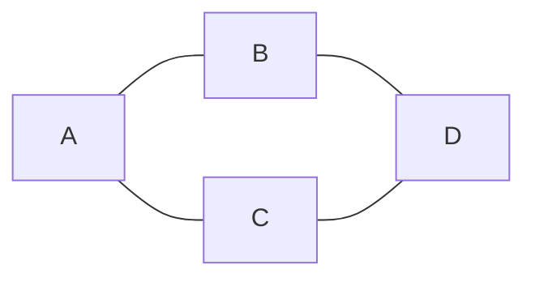

有向图边**带有方向**，顶点之间是**单向指向**关系。

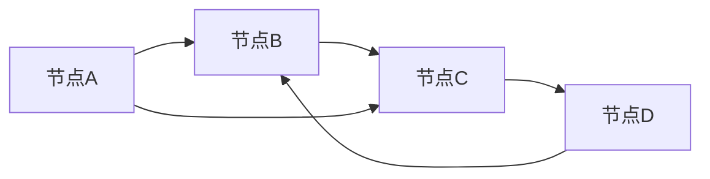

| 对比维度       | 无向图                   | 有向图                                 |
| -------------- | ------------------------ | -------------------------------------- |
| **边的方向**   | 无方向、双向             | 有方向、单向                           |
| **连通性**     | A 连 B ⇔ B 连 A          | A 指向 B，B 不一定指向 A               |
| **度的概念**   | 只有「度数」             | 分为**入度**、**出度**、总度           |
| **边重复规则** | 无重复反向边             | 允许双向两条独立边                     |
| **回路 / 环**  | 无向环                   | 有向环（严格按方向走）                 |
| **典型场景**   | 社交好友、道路互通、电网 | 网页跳转、任务依赖、单向交通、流程审批 |

1. 邻接矩阵

- 无向图：矩阵**对称**
- 有向图：矩阵**不对称**

1. 遍历

- 无向图：遍历要避免回头重复访问父节点
- 有向图：需要考虑路径方向，常考**拓扑排序**（有向无环图 DAG）

### 度

**度**是指与该顶点相邻的边的数量

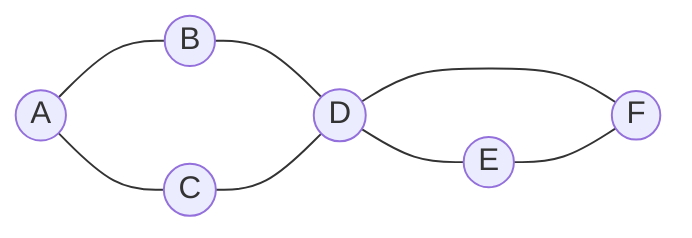

例如上图中

* A、B、C、E、F 这几个顶点度数为 2
* D 顶点度数为 4

有向图中，细分为**入度**和**出度**，参见下图

1. 出度（出去的箭头）**出度：从当前点，指出去的箭头数量**
2. 入度（进来的箭头）**入度：指向当前点，进来的箭头数量**

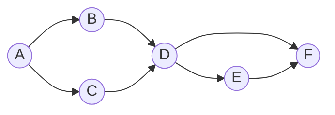

* A (2 out / 0 in)
* B、C、E (1 out / 1 in)
* D (2 out / 2 in)
* F (0 out / 2 in)

### 权

1. 边可以有权重，代表从源顶点到目标顶点的距离、费用、时间或其他度量。
2. 图里每条边上可以带一个数值，这个数就叫权 / 权重。
3. 带权的图 = 网 / 带权图 ✅ 通俗理解： 
4. 道路图：权 = 距离、耗时、过路费 社交图：
5. 权 = 亲密度 路线算法：
6. 权 = 成本 无向边、有向边都可以加权重

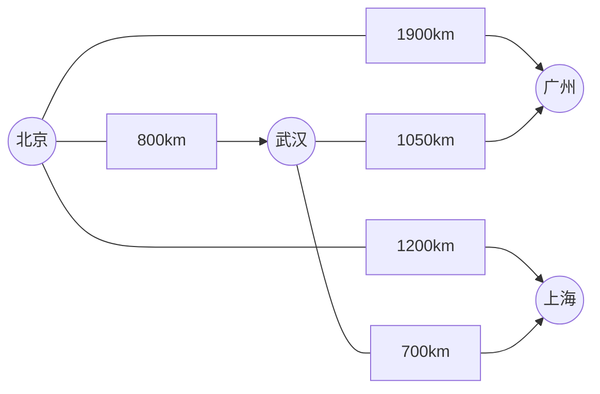

### 路径

从一个顶点出发，顺着边走，依次经过的「顶点序列」。

路径被定义为从一个顶点到另一个顶点的一系列连续边，例如上图中【北京】到【上海】有多条路径

* 北京 - 上海
* 北京 - 武汉 - 上海

路径长度

* 不考虑权重，长度就是边的数量
* 考虑权重，一般就是权重累加

### 环

在有向图中，从一个顶点开始，可以通过若干条有向边返回到该顶点，那么就形成了一个环

**环**：起点和终点是同一个点的路径

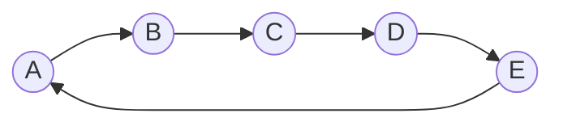


### 图的连通性

如果两个顶点之间存在路径，则这两个顶点是连通的，所有顶点都连通，则该图被称之为连通图，若子图连通，则称为连通分量

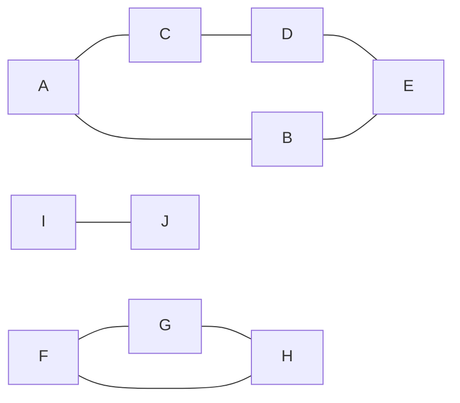


 **强连通**：有向图，两两互相能走到

**弱连通**：有向图，拆箭头才连通，单向走不通

**二分图**：点分两组，组内无边，组间互连、无奇数环

## 图的表示

1. **邻接矩阵：稠密图、查边快**
2. **邻接表：稀疏图、遍历出边**
3. **逆邻接表：有向图、遍历入边**
4. **十字链表：有向图、出入边都要查**
5. **边集数组：按边操作，Kruskal 专用**

比如说，下面的图


用**邻接矩阵**（二维数组）可以表示为：

无向图：矩阵**对称**

查找两点是否有边：**超快 O (1)**

缺点：顶点少、边少时**浪费空间**（稀疏图不适合）

```
  A B C D
A 0 1 1 0
B 1 0 0 1 
C 1 0 0 1
D 0 1 1 0
```

用**邻接表**（数组 + 链表 / 集合）可以表示为：

1. 每个顶点单独挂一个链表，存储它**直接相连的邻接点**
2. 有向图：只存出边
3. 特点

- 节省空间，**稀疏图首选**
- 遍历邻接点快
- 缺点：判断两点是否有边较慢，需要遍历链表

```
A -> B -> C
B -> A -> D
C -> A -> D
D -> B -> C
```

有向图的例子

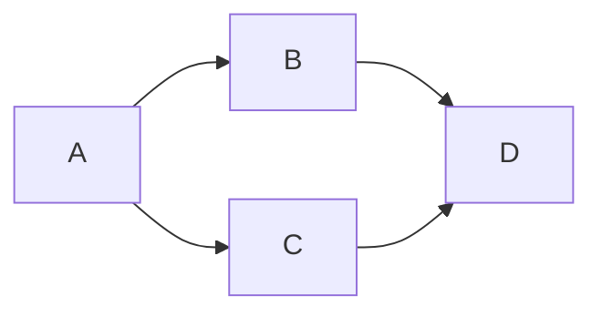

```
  A B C D
A 0 1 1 0
B 0 0 0 1
C 0 0 0 1
D 0 0 0 0
```

```
A - B - C
B - D
C - D
D - empty
```

## 遍历

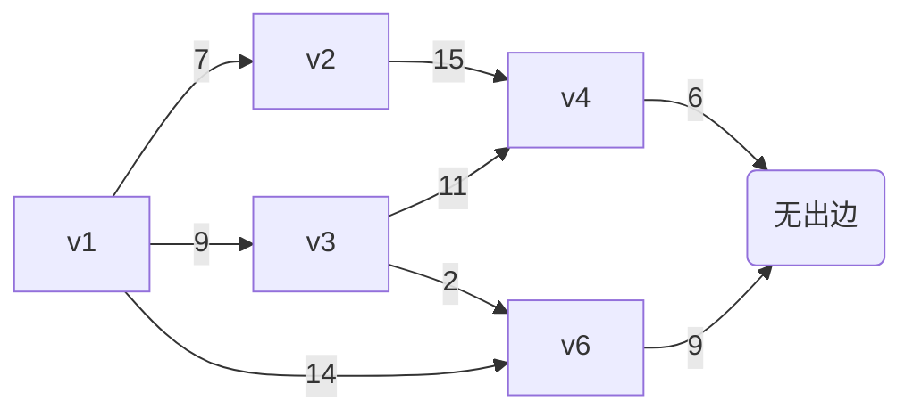

**BFS 广度**：队列、一层一层、最短路径

**DFS 深度**：递归 / 栈、一条路走到黑、回溯


### DFS

**DFS** 深度优先搜索

从起点出发，**一条路走到黑**，能往下走就一直往下钻，走不通（没路 / 都访问过）再**回头回溯**，再走别的分支。

口诀：**一条路走到底，走不动再回头**

标记当前节点 **已访问**

打印 / 处理当前节点

遍历当前所有相邻节点

没访问过的，**递归深度搜索**

全部走完自动回溯

**行走逻辑**

1. 先走 **v1 → v3**
2. v3 继续往下走 **v3 → v4**
3. v4 继续往下走 **v4 → v5**（v5 没路了）
4. 回溯回到 v3，走下一个 **v3 → v6**
5. v6 往下走 **v6 → v5（已访问）**，无路
6. 回溯回到 v1，走 **v1 → v2**
7. v2→v4（已访问），全部结束

```
package com.itheima.datastructure.graph;

import java.util.LinkedList;
import java.util.List;

/**
 * <h3>深度优先搜索 Depth-first search</h3>
 */
public class DFS {

    public static void main(String[] args) {
        Vertex v1 = new Vertex("v1");
        Vertex v2 = new Vertex("v2");
        Vertex v3 = new Vertex("v3");
        Vertex v4 = new Vertex("v4");
        Vertex v5 = new Vertex("v5");
        Vertex v6 = new Vertex("v6");

        v1.edges = List.of(
                new Edge(v3, 9),
                new Edge(v2, 7),
                new Edge(v6, 14)
        );
        v2.edges = List.of(new Edge(v4, 15));
        v3.edges = List.of(
                new Edge(v4, 11),
                new Edge(v6, 2)
        );
        v4.edges = List.of(new Edge(v5, 6));
        v5.edges = List.of();
        v6.edges = List.of(new Edge(v5, 9));

        dfs2(v1);
    }

    private static void dfs2(Vertex v) {
        LinkedList<Vertex> stack = new LinkedList<>();
        stack.push(v);
        while (!stack.isEmpty()) {
            Vertex pop = stack.pop();
            pop.visited = true;
            System.out.println(pop.name);
            for (Edge edge : pop.edges) {
                if (!edge.linked.visited) {
                    stack.push(edge.linked);
                }
            }
        }
    }

    private static void dfs(Vertex v) {
        v.visited = true;
        System.out.println(v.name);
        for (Edge edge : v.edges) {
            if (!edge.linked.visited) {
                dfs(edge.linked);
            }
        }
    }
}

```

```
v1
v6
v5
v2
v4
v3
```

### BFS

为什么BFS能求得最短路径

BFS 采用**层序遍历**，由近及远逐层搜索；

每一层对应一条边的距离，保证**先访问到目标节点的路径边数最少**；

节点只访问一次，避免重复绕路，因此**首次到达终点即为无权图最短路径**。

**BFS** 广度优先搜索

从起始顶点开始，**先访问自己 → 再把当前节点所有相邻节点全部访问完**，再一层层往下扩散，像**水波扩散、地毯式搜索**。

口诀：**先近后远，一层一层向外搜**

准备**队列**、标记 `visited` 防止重复走、死循环

起点标记已访问，入队

循环：

- 出队一个节点，打印 / 处理
- 遍历它所有相连边（邻居）
- 没访问过的：标记 + 入队

队列为空，遍历结束

**行走逻辑**

1. 第一层：访问 **v1**
2. 第二层：一次性访问 v1 所有邻居 → **v3、v2、v6**
3. 第三层：再依次访问 v3/v2/v6 的邻居 → **v4、v5**
4. 第四层：最后访问 **v5** 无邻居

```
package com.itheima.datastructure.graph;

import java.util.LinkedList;
import java.util.List;

/**
 * <h3>广度优先搜索 Breadth-first search</h3>
 */
public class BFS {

    public static void main(String[] args) {
        Vertex v1 = new Vertex("v1");
        Vertex v2 = new Vertex("v2");
        Vertex v3 = new Vertex("v3");
        Vertex v4 = new Vertex("v4");
        Vertex v5 = new Vertex("v5");
        Vertex v6 = new Vertex("v6");

        v1.edges = List.of(
                new Edge(v3, 9),
                new Edge(v2, 7),
                new Edge(v6, 14)
        );
        v2.edges = List.of(new Edge(v4, 15));
        v3.edges = List.of(
                new Edge(v4, 11),
                new Edge(v6, 2)
        );
        v4.edges = List.of(new Edge(v5, 6));
        v5.edges = List.of();
        v6.edges = List.of(new Edge(v5, 9));

        bfs(v1);
    }

    private static void bfs(Vertex v) {
        LinkedList<Vertex> queue = new LinkedList<>();
        // 1. 标记当前顶点为已访问
        v.visited = true;
        // 2. 将当前顶点加入队列
        queue.offer(v);
        while (!queue.isEmpty()) {
            Vertex poll = queue.poll();
            System.out.println(poll.name);
            // 3. 遍历当前顶点的所有邻接顶点
            // 4. 标记未访问的邻接顶点为已访问
            // 5. 将未访问的邻接顶点加入队列
            for (Edge edge : poll.edges) {
                if (!edge.linked.visited) {
                    edge.linked.visited = true;
                    queue.offer(edge.linked);
                }
            }
        }
    }
}

```

```
v1
v3
v2
v6
v4
v5
```


## 拓扑排序

拓扑排序是有向无环图 (DAG) 中，根据前后依赖关系，由入度为 0 节点开始，依次排出的线性先后顺序，用来解决任务依赖与环检测。

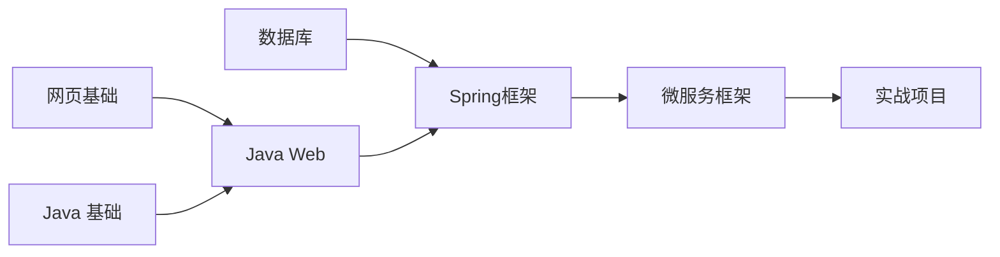

拓扑排序：针对有向无环图（DAG） 的一种排序方式简单说： 

有先后依赖关系，必须先做 A，再做 B，按依赖顺序排好所有节点 前提： 

必须是有向图（有箭头） 不能有环（不能 A→B 又 B→A，死循环排不了）

1. Kahn (入度 + 队列)

   靠入度

   干活，直观、能判环，工作考试首选。

2. DFS 后序逆序

   靠

   深度优先回溯

   干活，代码短，适合简答。

拓扑排序两种实现：

1. **Kahn 算法：入度数组 + 队列**
2. **DFS 算法：后序遍历 + 逆序**


### Kahn

**入度表 + 队列（Kahn 算法）**

1. 统计所有顶点**入度**

2. 把**入度 = 0** 的节点入队

3. 出队一个节点，加入拓扑结果

4. 它的邻接点**入度 - 1**

5. 若邻接点入度变为 0，继续入队

6. 最后：

   - 输出节点数 = 总节点数 → 无环 (DAG)
   - 少于总节点数 → **有环，无法拓扑**

   

**特点**

- 能**判断有没有环**
- 能直观看到依赖
- 面试、工程、教材**主流写法**

```
package com.itheima.datastructure.graph;

import java.util.ArrayList;
import java.util.LinkedList;
import java.util.List;
import java.util.Queue;

/**
 * <h3>拓扑排序 Kahn's algorithm</h3>
 */
public class TopologicalSort {

    public static void main(String[] args) {
        Vertex v1 = new Vertex("网页基础");
        Vertex v2 = new Vertex("Java基础");
        Vertex v3 = new Vertex("JavaWeb");
        Vertex v4 = new Vertex("Spring框架");
        Vertex v5 = new Vertex("微服务框架");
        Vertex v6 = new Vertex("数据库");
        Vertex v7 = new Vertex("实战项目");

        v1.edges = List.of(new Edge(v3)); // +1
        v2.edges = List.of(new Edge(v3)); // +1
        v3.edges = List.of(new Edge(v4));
        v6.edges = List.of(new Edge(v4));
        v4.edges = List.of(new Edge(v5));
        v5.edges = List.of(new Edge(v7));
        v7.edges = List.of();

        List<Vertex> graph = List.of(v1, v2, v3, v4, v5, v6, v7);
        // 1. 统计每个顶点的入度
        for (Vertex v : graph) {
            for (Edge edge : v.edges) {
                edge.linked.inDegree++;
            }
        }
        /*for (Vertex vertex : graph) {
            System.out.println(vertex.name + " " + vertex.inDegree);
        }*/
        // 2. 将入度为0的顶点加入队列
        LinkedList<Vertex> queue = new LinkedList<>();
        for (Vertex v : graph) {
            if (v.inDegree == 0) {
                queue.offer(v);
            }
        }
        // 3. 队列中不断移除顶点，每移除一个顶点，把它相邻顶点入度减1，若减到0则入队
        List<String> result = new ArrayList<>();
        while (!queue.isEmpty()) {
            Vertex poll = queue.poll();
//            System.out.println(poll.name);
            result.add(poll.name);
            for (Edge edge : poll.edges) {
                edge.linked.inDegree--;
                if (edge.linked.inDegree == 0) {
                    queue.offer(edge.linked);
                }
            }
        }
        if (result.size() != graph.size()) {
            System.out.println("出现环");
        } else {
            for (String key : result) {
                System.out.println(key);
            }
        }
    }
}

```


### DFS

**深度优先 DFS 逆序输出**

**原理**

1. 递归 DFS 遍历
2. 一个节点**所有后继都遍历完**，再把该节点加入集合
3. 最后**反转集合**，就是拓扑顺序

**特点**

- 代码简洁、递归实现
- 不太好直观计算入度
- 也可检测环（需要标记递归栈）

```
package com.itheima.datastructure.graph;

import java.util.LinkedList;
import java.util.List;

/**
 * <h3>拓扑排序 DFS</h3>
 */
public class TopologicalSortDFS {

    public static void main(String[] args) {
        Vertex v1 = new Vertex("网页基础");
        Vertex v2 = new Vertex("Java基础");
        Vertex v3 = new Vertex("JavaWeb");
        Vertex v4 = new Vertex("Spring框架");
        Vertex v5 = new Vertex("微服务框架");
        Vertex v6 = new Vertex("数据库");
        Vertex v7 = new Vertex("实战项目");

        v1.edges = List.of(new Edge(v3));
        v2.edges = List.of(new Edge(v3));
        v3.edges = List.of(new Edge(v4));
        v6.edges = List.of(new Edge(v4));
        v4.edges = List.of(new Edge(v5));
        v5.edges = List.of(new Edge(v7));
        v7.edges = List.of();

        List<Vertex> graph = List.of(v1, v2, v3, v4, v5, v6, v7);

        LinkedList<String> stack = new LinkedList<>();
        for (Vertex v : graph) {
            dfs(v, stack);
        }
        System.out.println(stack);
    }

    private static void dfs(Vertex v, LinkedList<String> stack) {
        if (v.status == 2) {
            return;
        }
        if (v.status == 1) {
            throw new RuntimeException("发现了环");
        }
        v.status = 1;
        for (Edge edge : v.edges) {
            dfs(edge.linked, stack);
        }
        v.status = 2;
        stack.push(v.name);
    }


}

```

##  最短路径

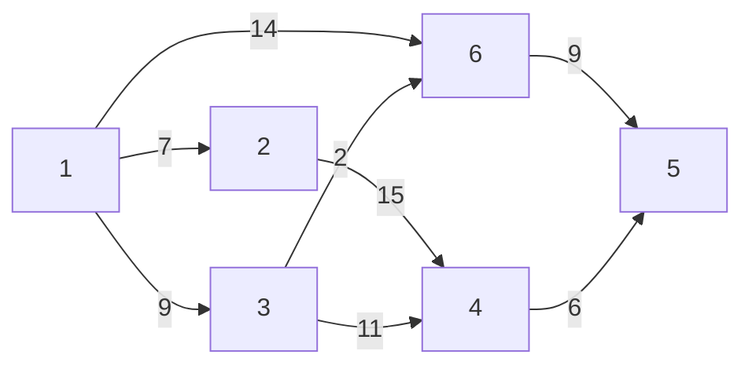

### Dijkstra

**带权有向 / 无向图**中，求**单个起点 到 所有其他顶点的最短路径**算法。

✅ 适用：**边权必须 ≥ 0**（不能有负权）

每次从**未确定最短距离的点**里，选出**当前距离最短**的顶点，

以它为中间点，**更新其他点的最短距离**（松弛操作）。

算法描述：

1. 将所有顶点标记为未访问。创建一个未访问顶点的集合。
2. 为每个顶点分配一个临时距离值
   * 对于我们的初始顶点，将其设置为零
   * 对于所有其他顶点，将其设置为无穷大。
3. 每次选择最小临时距离的未访问顶点，作为新的当前顶点
4. 对于当前顶点，遍历其所有未访问的邻居，并更新它们的临时距离为更小
   * 例如，1->6 的距离是 14，而1->3->6 的距离是11。这时将距离更新为 11
   * 否则，将保留上次距离值
5. 当前顶点的邻居处理完成后，把它从未访问集合中删除

```
public class Dijkstra {
    public static void main(String[] args) {
        Vertex v1 = new Vertex("v1");
        Vertex v2 = new Vertex("v2");
        Vertex v3 = new Vertex("v3");
        Vertex v4 = new Vertex("v4");
        Vertex v5 = new Vertex("v5");
        Vertex v6 = new Vertex("v6");

        v1.edges = List.of(new Edge(v3, 9), new Edge(v2, 7), new Edge(v6, 14));
        v2.edges = List.of(new Edge(v4, 15));
        v3.edges = List.of(new Edge(v4, 11), new Edge(v6, 2));
        v4.edges = List.of(new Edge(v5, 6));
        v5.edges = List.of();
        v6.edges = List.of(new Edge(v5, 9));

        List<Vertex> graph = List.of(v1, v2, v3, v4, v5, v6);

        dijkstra(graph, v1);
    }

    private static void dijkstra(List<Vertex> graph, Vertex source) {
        ArrayList<Vertex> list = new ArrayList<>(graph);
        source.dist = 0;

        while (!list.isEmpty()) {
            // 3. 选取当前顶点
            Vertex curr = chooseMinDistVertex(list);
            // 4. 更新当前顶点邻居距离
            updateNeighboursDist(curr, list);
            // 5. 移除当前顶点
            list.remove(curr);
        }

        for (Vertex v : graph) {
            System.out.println(v.name + " " + v.dist);
        }
    }

    private static void updateNeighboursDist(Vertex curr, ArrayList<Vertex> list) {
        for (Edge edge : curr.edges) {
            Vertex n = edge.linked;
            if (list.contains(n)) {
                int dist = curr.dist + edge.weight;
                if (dist < n.dist) {
                    n.dist = dist;
                }
            }
        }
    }

    private static Vertex chooseMinDistVertex(ArrayList<Vertex> list) {
        Vertex min = list.get(0);
        for (int i = 1; i < list.size(); i++) {
            if (list.get(i).dist < min.dist) {
                min = list.get(i);
            }
        }
        return min;
    }

}
```

```
v1(0) <- null
v2(7) <- v1
v3(9) <- v1
v4(20) <- v3
v5(20) <- v6
v6(11) <- v3
右侧是上一节点是什么
```

**改进 - 优先级队列**

1. 创建一个优先级队列，放入所有顶点（队列大小会达到边的数量）
2. 为每个顶点分配一个临时距离值
   * 对于我们的初始顶点，将其设置为零
   * 对于所有其他顶点，将其设置为无穷大。
3. 每次选择最小临时距离的未访问顶点，作为新的当前顶点
4. 对于当前顶点，遍历其所有未访问的邻居，并更新它们的临时距离为更小，若距离更新需加入队列
   * 例如，1->6 的距离是 14，而1->3->6 的距离是11。这时将距离更新为 11
   * 否则，将保留上次距离值
5. 当前顶点的邻居处理完成后，把它从队列中删除

```java
public class DijkstraPriorityQueue {
    public static void main(String[] args) {
        Vertex v1 = new Vertex("v1");
        Vertex v2 = new Vertex("v2");
        Vertex v3 = new Vertex("v3");
        Vertex v4 = new Vertex("v4");
        Vertex v5 = new Vertex("v5");
        Vertex v6 = new Vertex("v6");

        v1.edges = List.of(new Edge(v3, 9), new Edge(v2, 7), new Edge(v6, 14));
        v2.edges = List.of(new Edge(v4, 15));
        v3.edges = List.of(new Edge(v4, 11), new Edge(v6, 2));
        v4.edges = List.of(new Edge(v5, 6));
        v5.edges = List.of();
        v6.edges = List.of(new Edge(v5, 9));

        List<Vertex> graph = List.of(v1, v2, v3, v4, v5, v6);

        dijkstra(graph, v1);
    }

    private static void dijkstra(List<Vertex> graph, Vertex source) {
        PriorityQueue<Vertex> queue = new PriorityQueue<>(Comparator.comparingInt(v -> v.dist));
        source.dist = 0;
        for (Vertex v : graph) {
            queue.offer(v);
        }

        while (!queue.isEmpty()) {
            System.out.println(queue);
            // 3. 选取当前顶点
            Vertex curr = queue.peek();
            // 4. 更新当前顶点邻居距离
            if(!curr.visited) {
                updateNeighboursDist(curr, queue);
                curr.visited = true;
            }
            // 5. 移除当前顶点
            queue.poll();
        }

        for (Vertex v : graph) {
            System.out.println(v.name + " " + v.dist + " " + (v.prev != null ? v.prev.name : "null"));
        }
    }

    private static void updateNeighboursDist(Vertex curr, PriorityQueue<Vertex> queue) {
        for (Edge edge : curr.edges) {
            Vertex n = edge.linked;
            if (!n.visited) {
                int dist = curr.dist + edge.weight;
                if (dist < n.dist) {
                    n.dist = dist;
                    n.prev = curr;
                    queue.offer(n);
                }
            }
        }
    }

}
```


**问题**

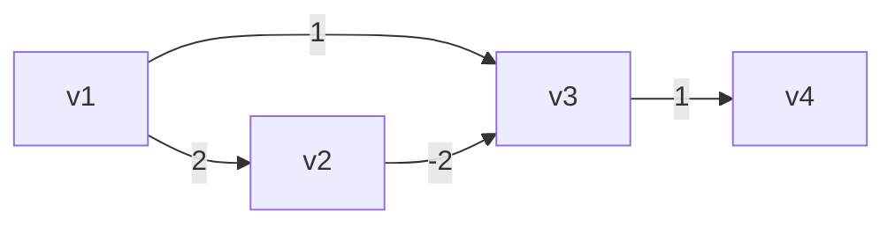

按照 Dijkstra 算法，得出

* v1 -> v2 最短距离2
* v1 -> v3 最短距离1
* v1 -> v4 最短距离2

事实应当是

* v1 -> v2 最短距离2
* v1 -> v3 最短距离0
* v1 -> v4 最短距离1


### Bellman-Ford

Bellman-Ford 单源最短路，暴力遍历所有边松弛 n-1 轮，支持负权边，可检测负权环。

**Bellman-Ford** 是**单源最短路径**算法。

- 从**一个起点**，算出到图中所有节点的最短路径
- 核心优势：**支持负权边**（Dijkstra 不行）

```java
public class BellmanFord {
    public static void main(String[] args) {
        // 正常情况
        /*Vertex v1 = new Vertex("v1");
        Vertex v2 = new Vertex("v2");
        Vertex v3 = new Vertex("v3");
        Vertex v4 = new Vertex("v4");
        Vertex v5 = new Vertex("v5");
        Vertex v6 = new Vertex("v6");

        v1.edges = List.of(new Edge(v3, 9), new Edge(v2, 7), new Edge(v6, 14));
        v2.edges = List.of(new Edge(v4, 15));
        v3.edges = List.of(new Edge(v4, 11), new Edge(v6, 2));
        v4.edges = List.of(new Edge(v5, 6));
        v5.edges = List.of();
        v6.edges = List.of(new Edge(v5, 9));

        List<Vertex> graph = List.of(v4, v5, v6, v1, v2, v3);*/

        // 负边情况
        /*Vertex v1 = new Vertex("v1");
        Vertex v2 = new Vertex("v2");
        Vertex v3 = new Vertex("v3");
        Vertex v4 = new Vertex("v4");

        v1.edges = List.of(new Edge(v2, 2), new Edge(v3, 1));
        v2.edges = List.of(new Edge(v3, -2));
        v3.edges = List.of(new Edge(v4, 1));
        v4.edges = List.of();
        List<Vertex> graph = List.of(v1, v2, v3, v4);*/

        // 负环情况
        Vertex v1 = new Vertex("v1");
        Vertex v2 = new Vertex("v2");
        Vertex v3 = new Vertex("v3");
        Vertex v4 = new Vertex("v4");

        v1.edges = List.of(new Edge(v2, 2));
        v2.edges = List.of(new Edge(v3, -4));
        v3.edges = List.of(new Edge(v4, 1), new Edge(v1, 1));
        v4.edges = List.of();
        List<Vertex> graph = List.of(v1, v2, v3, v4);

        bellmanFord(graph, v1);
    }

    private static void bellmanFord(List<Vertex> graph, Vertex source) {
        source.dist = 0;
        int size = graph.size();
        // 1. 进行 顶点个数 - 1 轮处理
        for (int i = 0; i < size - 1; i++) {
            // 2. 遍历所有的边
            for (Vertex s : graph) {
                for (Edge edge : s.edges) {
                    // 3. 处理每一条边
                    Vertex e = edge.linked;
                    if (s.dist != Integer.MAX_VALUE && s.dist + edge.weight < e.dist) {
                        e.dist = s.dist + edge.weight;
                        e.prev = s;
                    }
                }
            }
        }
        for (Vertex v : graph) {
            System.out.println(v + " " + (v.prev != null ? v.prev.name : "null"));
        }
    }
}
```


**负环**

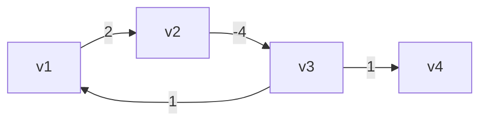

如果在【顶点-1】轮处理完成后，还能继续找到更短距离，表示发现了负环


### Floyd-Warshall

**多源最短路径算法**，一次性算出**图中任意两个顶点**之间的最短距离。

Floyd-Warshall 是**多源最短路**算法，利用中间中转点思想，三层循环动态规划，支持负权边，适合小点集全局最短路求解。

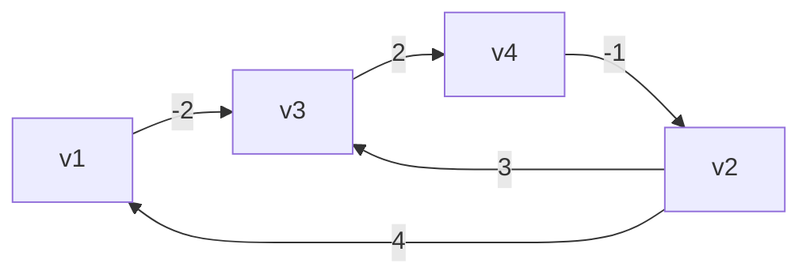

```java
public class FloydWarshall {
    public static void main(String[] args) {
        Vertex v1 = new Vertex("v1");
        Vertex v2 = new Vertex("v2");
        Vertex v3 = new Vertex("v3");
        Vertex v4 = new Vertex("v4");

        v1.edges = List.of(new Edge(v3, -2));
        v2.edges = List.of(new Edge(v1, 4), new Edge(v3, 3));
        v3.edges = List.of(new Edge(v4, 2));
        v4.edges = List.of(new Edge(v2, -1));
        List<Vertex> graph = List.of(v1, v2, v3, v4);

        /*
                直接连通
                v1  v2  v3  v4
            v1  0   ∞   -2  ∞
            v2  4   0   3   ∞
            v3  ∞   ∞   0   2
            v4  ∞   -1  ∞   0

                k=0 借助v1到达其它顶点
                v1  v2  v3  v4
            v1  0   ∞   -2  ∞
            v2  4   0   2   ∞
            v3  ∞   ∞   0   2
            v4  ∞   -1  ∞   0

                k=1 借助v2到达其它顶点
                v1  v2  v3  v4
            v1  0   ∞   -2  ∞
            v2  4   0   2   ∞
            v3  ∞   ∞   0   2
            v4  3   -1  1   0

                k=2 借助v3到达其它顶点
                v1  v2  v3  v4
            v1  0   ∞   -2  0
            v2  4   0   2   4
            v3  ∞   ∞   0   2
            v4  3   -1  1   0

                k=3 借助v4到达其它顶点
                v1  v2  v3  v4
            v1  0   -1   -2  0
            v2  4   0   2   4
            v3  5   1   0   2
            v4  3   -1  1   0
         */
        floydWarshall(graph);
    }

    static void floydWarshall(List<Vertex> graph) {
        int size = graph.size();
        int[][] dist = new int[size][size];
        Vertex[][] prev = new Vertex[size][size];
        // 1）初始化
        for (int i = 0; i < size; i++) {
            Vertex v = graph.get(i); // v1 (v3)
            Map<Vertex, Integer> map = v.edges.stream().collect(Collectors.toMap(e -> e.linked, e -> e.weight));
            for (int j = 0; j < size; j++) {
                Vertex u = graph.get(j); // v3
                if (v == u) {
                    dist[i][j] = 0;
                } else {
                    dist[i][j] = map.getOrDefault(u, Integer.MAX_VALUE);
                    prev[i][j] = map.get(u) != null ? v : null;
                }
            }
        }
        print(prev);
        // 2）看能否借路到达其它顶点
        /*
            v2->v1          v1->v?
            dist[1][0]   +   dist[0][0]
            dist[1][0]   +   dist[0][1]
            dist[1][0]   +   dist[0][2]
            dist[1][0]   +   dist[0][3]
         */
        for (int k = 0; k < size; k++) {
            for (int i = 0; i < size; i++) {
                for (int j = 0; j < size; j++) {
//                    dist[i][k]   +   dist[k][j] // i行的顶点，借助k顶点，到达j列顶点
//                    dist[i][j]                  // i行顶点，直接到达j列顶点
                    if (dist[i][k] != Integer.MAX_VALUE &&
                            dist[k][j] != Integer.MAX_VALUE &&
                            dist[i][k] + dist[k][j] < dist[i][j]) {
                        dist[i][j] = dist[i][k] + dist[k][j];
                        prev[i][j] = prev[k][j];
                    }
                }
            }
//            print(dist);
        }
        print(prev);
    }

    static void path(Vertex[][] prev, List<Vertex> graph, int i, int j) {
        LinkedList<String> stack = new LinkedList<>();
        System.out.print("[" + graph.get(i).name + "," + graph.get(j).name + "] ");
        stack.push(graph.get(j).name);
        while (i != j) {
            Vertex p = prev[i][j];
            stack.push(p.name);
            j = graph.indexOf(p);
        }
        System.out.println(stack);
    }

    static void print(int[][] dist) {
        System.out.println("-------------");
        for (int[] row : dist) {
            System.out.println(Arrays.stream(row).boxed()
                    .map(x -> x == Integer.MAX_VALUE ? "∞" : String.valueOf(x))
                    .map(s -> String.format("%2s", s))
                    .collect(Collectors.joining(",", "[", "]")));
        }
    }

    static void print(Vertex[][] prev) {
        System.out.println("-------------------------");
        for (Vertex[] row : prev) {
            System.out.println(Arrays.stream(row).map(v -> v == null ? "null" : v.name)
                    .map(s -> String.format("%5s", s))
                    .collect(Collectors.joining(",", "[", "]")));
        }
    }

}
```

**负环**

如果在 3 层循环结束后，在 dist 数组的对角线处（i==j 处）发现了负数，表示出现了负环

###  A* 启发式搜索

- 不是纯暴力，加**估价函数 h (x)**

- 公式：

  f(x)=g(x)+h(x)

  - g(x)：起点到当前真实距离
  - h(x)：预估到终点距离

  

- 场景：游戏寻路、地图导航、迷宫最短路径

- 特点：**定向搜索、更快找到终点**

### 总结

| 算法               | 类型           | 能否负权边 | 能否检测负环 | 核心思想           | 时间复杂度 | 适用场景                 |
| ------------------ | -------------- | ---------- | ------------ | ------------------ | ---------- | ------------------------ |
| **Dijkstra**       | 单源最短路     | ❌ 不支持   | ❌ 不能       | 贪心 + 优先队列    | O(mlogn)   | 正权图、大规模、效率高   |
| **Bellman-Ford**   | 单源最短路     | ✅ 支持     | ✅ 可以       | 暴力松弛 n−1 轮    | O(n⋅m)     | 负权边、点数少、需判负环 |
| **Floyd-Warshall** | **多源最短路** | ✅ 支持     | ✅ 可以       | 动态规划、中转点 k | O(n3)      | 求任意两点最短路、顶点少 |

## 最小生成树

### 1. 基本概念

**生成树（Spanning Tree）**

给一个 **无向连通图**，选一部分边满足：

1. 包含**所有顶点**

2. **没有环**

3. 连通整张图

   → 这就是生成树

------

**最小生成树（MST, Minimum Spanning Tree）**

在所有生成树里，**所有边的权值总和最小** 的那一棵。

------

### 2. 核心条件

- 只针对：**无向、连通、带权图**
- 结果：
  - 边数一定是：顶点数
  - 无环、全覆盖、总权重最小

------

### 3. 大白话例子

你有 A、B、C、D 四个村庄，要修路把全部连起来；

每条路造价不同，**要求花最少的钱连通所有村子**

👉 修出来的这套路线 = 最小生成树

------

### 4. 两大经典算法（必背）

**① Prim 算法**

- 思想：**加点法**（类似 Dijkstra）
- 从一个点出发，每次选「连接已选集合 & 权值最小」的点加入
- 适合：**稠密图（点少边多）**

**② Kruskal 算法**

- 思想：**加边法 + 并查集**
- 把所有边**从小到大排序**
- 依次选最短的边，**不构成环就选，成环就跳过**
- 适合：**稀疏图（边少）**，代码更好写

------

### 5. 快速区分记忆

表格

|  算法   |     核心     |  工具  |  适用  |
| :-----: | :----------: | :----: | :----: |
|  Prim   |     选点     |  贪心  | 稠密图 |
| Kruskal | 选短边、防环 | 并查集 | 稀疏图 |

------

### 6. 关键性质

1. MST 不一定唯一，但**总权值一定相同**
2. 只要无向连通带权图，一定存在最小生成树
3. 有环的边绝对不会被选进 MST

------

### 7. 串联你前面学的

- DFS/BFS：图遍历、拓扑排序
- Dijkstra/Bellman-Ford/Floyd：**最短路**
- **Prim / Kruskal：最小生成树**

### 8.代码实践

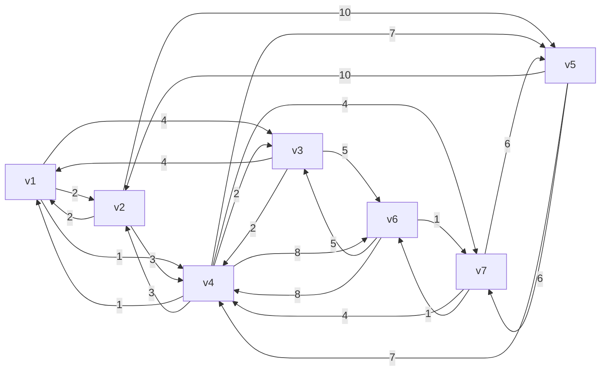

#### Prim

```java
public class Prim {
    public static void main(String[] args) {
        Vertex v1 = new Vertex("v1");
        Vertex v2 = new Vertex("v2");
        Vertex v3 = new Vertex("v3");
        Vertex v4 = new Vertex("v4");
        Vertex v5 = new Vertex("v5");
        Vertex v6 = new Vertex("v6");
        Vertex v7 = new Vertex("v7");

        v1.edges = List.of(new Edge(v2, 2), new Edge(v3, 4), new Edge(v4, 1));
        v2.edges = List.of(new Edge(v1, 2), new Edge(v4, 3), new Edge(v5, 10));
        v3.edges = List.of(new Edge(v1, 4), new Edge(v4, 2), new Edge(v6, 5));
        v4.edges = List.of(new Edge(v1, 1), new Edge(v2, 3), new Edge(v3, 2),
                new Edge(v5, 7), new Edge(v6, 8), new Edge(v7, 4));
        v5.edges = List.of(new Edge(v2, 10), new Edge(v4, 7), new Edge(v7, 6));
        v6.edges = List.of(new Edge(v3, 5), new Edge(v4, 8), new Edge(v7, 1));
        v7.edges = List.of(new Edge(v4, 4), new Edge(v5, 6), new Edge(v6, 1));

        List<Vertex> graph = List.of(v1, v2, v3, v4, v5, v6, v7);

        prim(graph, v1);

    }

    static void prim(List<Vertex> graph, Vertex source) {
        ArrayList<Vertex> list = new ArrayList<>(graph);
        source.dist = 0;

        while (!list.isEmpty()) {
            Vertex min = chooseMinDistVertex(list);
            updateNeighboursDist(min);
            list.remove(min);
            min.visited = true;
            System.out.println("---------------");
            for (Vertex v : graph) {
                System.out.println(v);
            }
        }


    }

    private static void updateNeighboursDist(Vertex curr) {
        for (Edge edge : curr.edges) {
            Vertex n = edge.linked;
            if (!n.visited) {
                int dist = edge.weight;
                if (dist < n.dist) {
                    n.dist = dist;
                    n.prev = curr;
                }
            }
        }
    }

    private static Vertex chooseMinDistVertex(ArrayList<Vertex> list) {
        Vertex min = list.get(0);
        for (int i = 1; i < list.size(); i++) {
            if (list.get(i).dist < min.dist) {
                min = list.get(i);
            }
        }
        return min;
    }
}
```

#### Kruskal

```java
public class Kruskal {
    static class Edge implements Comparable<Edge> {
        List<Vertex> vertices;
        int start;
        int end;
        int weight;

        public Edge(List<Vertex> vertices, int start, int end, int weight) {
            this.vertices = vertices;
            this.start = start;
            this.end = end;
            this.weight = weight;
        }

        public Edge(int start, int end, int weight) {
            this.start = start;
            this.end = end;
            this.weight = weight;
        }

        @Override
        public int compareTo(Edge o) {
            return Integer.compare(this.weight, o.weight);
        }

        @Override
        public String toString() {
            return vertices.get(start).name + "<->" + vertices.get(end).name + "(" + weight + ")";
        }
    }

    public static void main(String[] args) {
        Vertex v1 = new Vertex("v1");
        Vertex v2 = new Vertex("v2");
        Vertex v3 = new Vertex("v3");
        Vertex v4 = new Vertex("v4");
        Vertex v5 = new Vertex("v5");
        Vertex v6 = new Vertex("v6");
        Vertex v7 = new Vertex("v7");

        List<Vertex> vertices = List.of(v1, v2, v3, v4, v5, v6, v7);
        PriorityQueue<Edge> queue = new PriorityQueue<>(List.of(
                new Edge(vertices,0, 1, 2),
                new Edge(vertices,0, 2, 4),
                new Edge(vertices,0, 3, 1),
                new Edge(vertices,1, 3, 3),
                new Edge(vertices,1, 4, 10),
                new Edge(vertices,2, 3, 2),
                new Edge(vertices,2, 5, 5),
                new Edge(vertices,3, 4, 7),
                new Edge(vertices,3, 5, 8),
                new Edge(vertices,3, 6, 4),
                new Edge(vertices,4, 6, 6),
                new Edge(vertices,5, 6, 1)
        ));

        kruskal(vertices.size(), queue);
    }

    static void kruskal(int size, PriorityQueue<Edge> queue) {
        List<Edge> result = new ArrayList<>();
        DisjointSet set = new DisjointSet(size);
        while (result.size() < size - 1) {
            Edge poll = queue.poll();
            int s = set.find(poll.start);
            int e = set.find(poll.end);
            if (s != e) {
                result.add(poll);
                set.union(s, e);
            }
        }

        for (Edge edge : result) {
            System.out.println(edge);
        }
    }
}
```

##  并查集合

是一个用来快速处理 **集合合并、查询两点是否连通** 的数据结构

**并 Union**：把两个元素合成同一个集合

**查 Find**：判断两个元素是不是一家人（连通 / 同一个集合）

并查集是高效管理元素集合的数据结构，支持快速合并集合、查询连通性，是 Kruskal 最小生成树算法的核心工具，靠路径压缩与按秩合并保证高效。

#### 基础

```java
public class DisjointSet {
    int[] s;
    // 索引对应顶点
    // 元素是用来表示与之有关系的顶点
    /*
        索引  0  1  2  3  4  5  6
        元素 [0, 1, 2, 3, 4, 5, 6] 表示一开始顶点直接没有联系（只与自己有联系）

    */

    public DisjointSet(int size) {
        s = new int[size];
        for (int i = 0; i < size; i++) {
            s[i] = i;
        }
    }

    // find 是找到老大
    public int find(int x) {
        if (x == s[x]) {
            return x;
        }
        return find(s[x]);
    }

    // union 是让两个集合“相交”，即选出新老大，x、y 是原老大索引
    public void union(int x, int y) {
        s[y] = x;
    }

    @Override
    public String toString() {
        return Arrays.toString(s);
    }

}
```


#### 路径压缩

```java
public int find(int x) { // x = 2
    if (x == s[x]) {
        return x;
    }
    return s[x] = find(s[x]); // 0    s[2]=0
}
```


#### Union By Size

```java
public class DisjointSetUnionBySize {
    int[] s;
    int[] size;
    public DisjointSetUnionBySize(int size) {
        s = new int[size];
        this.size = new int[size];
        for (int i = 0; i < size; i++) {
            s[i] = i;
            this.size[i] = 1;
        }
    }

    // find 是找到老大 - 优化：路径压缩
    public int find(int x) { // x = 2
        if (x == s[x]) {
            return x;
        }
        return s[x] = find(s[x]); // 0    s[2]=0
    }

    // union 是让两个集合“相交”，即选出新老大，x、y 是原老大索引
    public void union(int x, int y) {
//        s[y] = x;
        if (size[x] < size[y]) {
            int t = x;
            x = y;
            y = t;
        }
        s[y] = x;
        size[x] = size[x] + size[y];
    }

    @Override
    public String toString() {
        return "内容："+Arrays.toString(s) + "\n大小：" + Arrays.toString(size);
    }

    public static void main(String[] args) {
        DisjointSetUnionBySize set = new DisjointSetUnionBySize(5);

        set.union(1, 2);
        set.union(3, 4);
        set.union(1, 3);
        System.out.println(set);
    }


}
```

